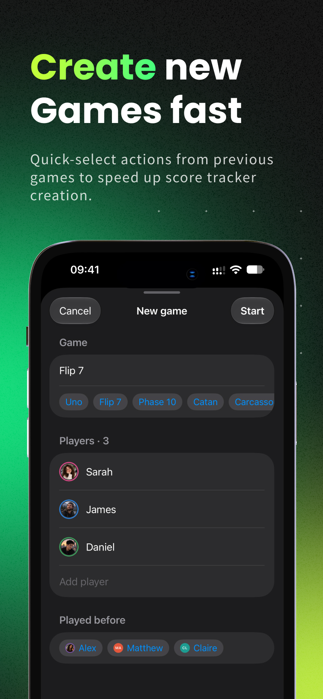
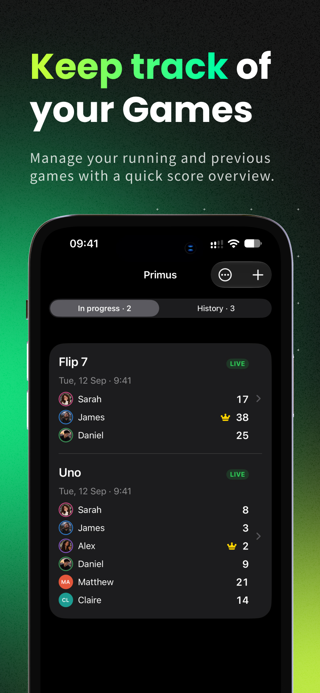
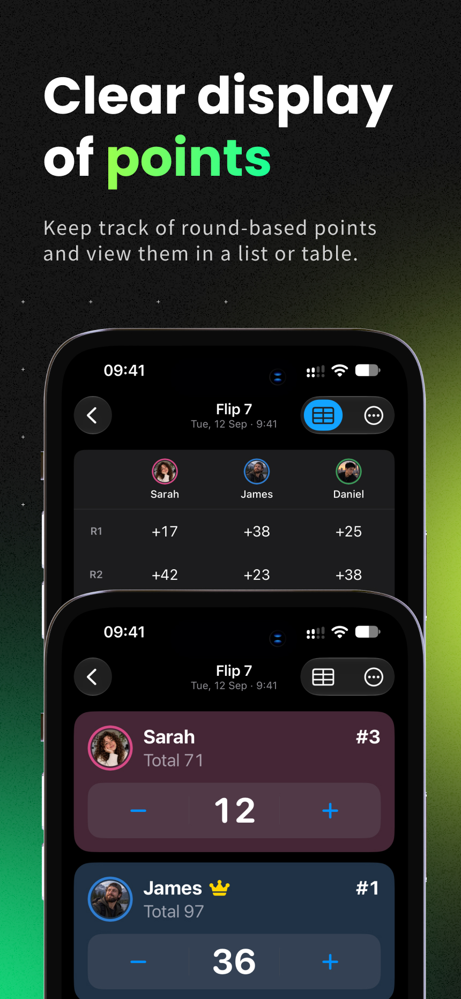
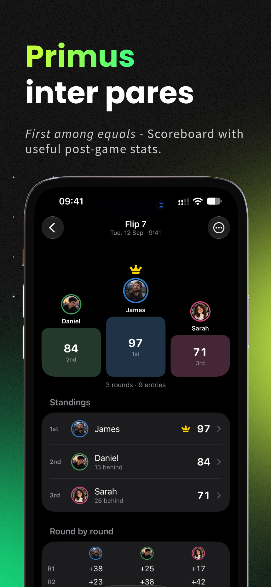

# Primus

**Keep the score. Enjoy the game.**

Primus is a simple score tracker for board games. Keep track of players, rounds and points without paper, pencils or mental math.

> **iOS available now. Android coming soon.**

## What you can do

### Keep score effortlessly
Create a game, add your players and update scores with simple **+ / −** controls.

### Play across multiple rounds
Track scores round by round and see the running total for every player. Switch to **Table view** when you want the complete score history at a glance.

### Make it work for your game
Use **Reverse scoring** when the lowest score wins, manually arrange players, or enter custom amounts with a tap.

### Useful game-night tools
Need a little help deciding who starts? Use the random **starting player** picker.

You also get a **dice** roller and **hourglass** for games that need them.

### See the full picture
Finish a game to see the final standings and stats. Every finished game is saved in **History**, so you can look back at previous games.

Tap a player to see their personal stats and customize their color or avatar.

<table>
  <tr>
    <td></td>
    <td></td>
    <td></td>
    <td></td>
  </tr>
</table>

## Made for board game nights

Primus is designed to stay out of the way: open it, add your players, and start playing.

No complicated setup. Just your game and the score.

## Get Primus

**iPhone & iPad:** [Download on the App Store](YOUR_APP_STORE_URL)

**Android:** Coming soon.

## Support

Need help, found a problem, or have an idea?

- [Read the support page](SUPPORT.md)
- [Report an issue or request a feature on GitHub](YOUR_GITHUB_ISSUES_URL)
- Email: primus.1ln1r@passmail.net

## Updates & previous releases

See [previous releases and updates](YOUR_GITHUB_RELEASES_URL).

---

### Links

[App Store](YOUR_APP_STORE_URL) · [Support](SUPPORT.md) · [Releases](YOUR_GITHUB_RELEASES_URL)
